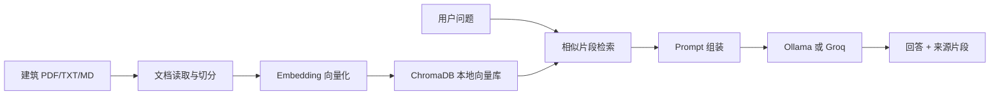

# 建筑知识库助手作品集页面草稿

## 项目名称

建筑知识库助手：面向建筑学习与方案研究的私有文献问答工具

## 项目背景

建筑学生和初级设计师在做课程论文、案例研究和方案前期分析时，经常需要反复翻阅 PDF、规范摘要、案例资料和课堂笔记。通用 AI 可以快速生成回答，但如果缺少明确来源，答案很难直接用于研究和设计论证。

本项目尝试用 RAG 技术搭建一个建筑垂直知识库助手，让用户把自己的建筑资料放入本地文档库，通过自然语言提问获得带来源的回答。

## 目标用户

- 建筑学学生
- 准备作品集和课程论文的申请者
- 需要快速整理案例与设计策略的初级设计师

## 核心问题

用户不是单纯想“问 AI 一个问题”，而是想从自己的建筑资料中快速找到可信依据，并把这些依据转化为可用于方案分析、论文写作和作品集表达的内容。

## 产品方案

### 核心功能

| 功能 | 说明 |
|---|---|
| 文档导入 | 支持在页面上传建筑 PDF、TXT、MD，也支持放入 documents 文件夹 |
| 文档索引 | 使用 ChromaDB 建立本地向量库 |
| 自然语言提问 | 用户输入建筑相关问题 |
| 基于资料回答 | 模型只根据检索到的文献片段回答 |
| 来源展示 | 回答后展示命中的原文片段，便于核验 |
| 模型切换 | 本地使用 Ollama，部署时可切换 Groq Cloud |

### 示例问题

- 被动式建筑设计中，应该如何降低建筑能耗？
- 既有建筑更新为什么有助于降低全生命周期碳排放？
- 适应性再利用项目中，新旧关系应该如何处理？
- 这些文献中有没有提到自然通风的设计方法？

## 技术架构



## 已完成原型

当前项目已经包含：

- `app.py`：Streamlit 应用主文件
- `requirements.txt`：依赖列表
- `documents/sample_architecture.txt`：建筑示例文档
- `README.md`：本地运行和部署说明
- `.streamlit/config.toml`：Streamlit Cloud 展示配置
- `.streamlit/secrets.toml.example`：Groq Cloud 密钥配置示例

本地运行命令：

```bash
pip install -r requirements.txt
streamlit run app.py
```

## 竞品洞察

ChatGPT、Perplexity 和 Notion AI 都证明了“AI + 文档/搜索/知识库”的价值，但它们主要面向通用场景。建筑知识库助手的差异化不在模型能力本身，而在建筑专业语境、私有资料管理、文献溯源和作品集场景。

## 后续迭代

1. 增加网页上传和 PDF 批量导入界面。
2. 按“规范、案例、理论、材料、可持续策略”自动分类文档。
3. 在回答中显示更细的页码、段落和引用编号。
4. 增加竞品分析、案例卡片和 Axure 原型截图展示区。
5. 部署到 Streamlit Cloud 或 Railway，生成公开演示链接。
